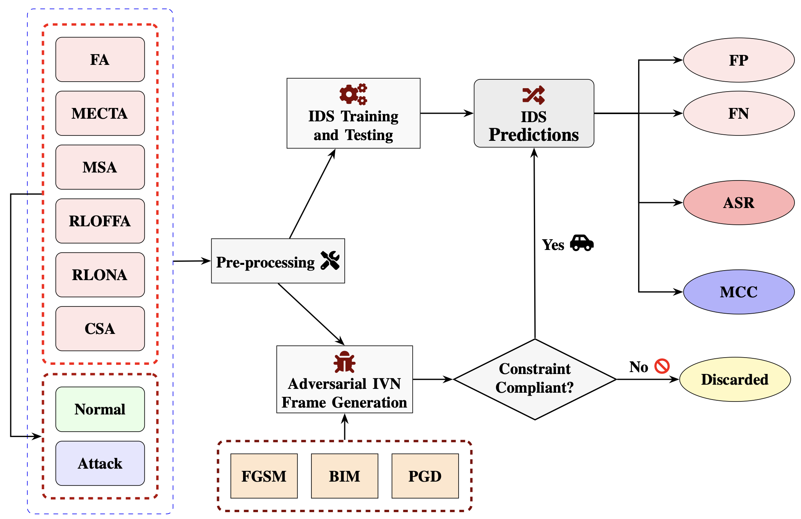

# Evaluating False Alarm and Missing Attacks in CAN IDS

This repository contains the full implementation and experimental pipeline for evaluating **adversarial robustness of machine-learning–based Intrusion Detection Systems (IDS)** operating on the **Controller Area Network (CAN)** using the **ROAD dataset**. 

The work systematically analyzes **false alarms (false positives)** and **missed attacks (false negatives)** under **protocol-compliant, payload-level adversarial perturbations**, following a unified evaluation framework.

This repository accompanies the research paper:

> **Evaluating False Alarm and Missing Attacks in CAN IDS**  
> *Nirab Hossain, Pablo Moriano*  
> University of Colorado Boulder & Oak Ridge National Laboratory

---

## 📌 Project Overview

Modern vehicles rely on the CAN bus for safety-critical communication but lack built-in security mechanisms. Machine-learning–based IDS achieve strong detection accuracy under benign conditions, yet their **robustness against adversarial manipulation remains insufficiently understood**.

This project develops a **unified adversarial evaluation framework** for CAN intrusion detection systems (IDS), explicitly analyzing two coupled failure modes under realistic, protocol-compliant constraints.

### 🎯 Main Objectives

- Evaluate **adversarial failure modes** of CAN IDS:
  - **False alarms (False Positives):** benign → malicious
  - **Missed attacks (False Negatives):** malicious → benign
- Apply **protocol-compliant, payload-only adversarial perturbations** on CAN frames
- Compare robustness across **shallow ML models (DT, RF, ET, XGB)** and **Deep Neural Networks (DNN)**
- Quantify robustness using:
  - **ASR[FP]** – False-alarm inducibility
  - **ASR[FN]** – Missed-attack inducibility
  - **MCC** – Overall performance under class imbalance

---


## ❓ Key Research Question
How do shallow ML and DNN-based CAN IDS differ in **robustness to adversarial manipulation**, when both **false alarms** and **missed attacks** are evaluated *separately and jointly* under CAN-valid constraints?
<!--
### Hypothesis
1. **Clean-test accuracy is not sufficient**: IDS that perform well on benign settings can still exhibit significant vulnerability under adversarial perturbations.
2. Under **payload-only, protocol-compliant attacks**, IDS will generally be:
   - relatively **robust to false-alarm induction** on benign frames, but
   - substantially **more vulnerable to missed-attack induction** on malicious frames.
3. **Model architecture matters**: ensemble tree methods (especially **Extra Trees**) may show more consistent missed-attack robustness than other shallow learners and DNNs under strong multi-step attacks.
-->
---

## 🧩 Experimental Workflow (Paper)

### Phase 1 — Dataset + Frame-Level Modeling
- Use the **ROAD CAN IDS dataset** (12 ambient captures, 33 attack captures; ~3.5 hours of CAN traffic).  
- Treat each CAN frame **independently** (no windowing): features are payload bytes **D0–D7**, label is benign (0) vs malicious (1).  

### Phase 2 — Train IDS Baselines
Train five classifiers for binary frame-level IDS:
- DT, RF, ET, XGB (shallow)
- DNN (4 fully-connected layers, ReLU; sigmoid output)

### Phase 3 — Protocol-Compliant Adversarial Evaluation
- Threat model: **gray-bus attacker** + **white-box** knowledge for gradient-based perturbations.
- Perturbation constraints:
  - **CAN ID and DLC fixed**
  - **payload bytes only**
  - values **clipped to [0, 255]**
- Generate adversarial frames using **FGSM / BIM / PGD** with budgets **ε ∈ {1, 5}**
- Use a differentiable **DNN surrogate** to craft attacks; reuse adversarial samples to evaluate shallow models (transfer-style).

### Phase 4 — Metrics (Robustness + Imbalance-Aware Performance)
- **ASR** (Attack Success Rate) computed separately for:
  - **ASR[FP]** on adversarially perturbed benign frames
  - **ASR[FN]** on adversarially perturbed malicious frames
- **MCC** (Matthews Correlation Coefficient) on the full (imbalanced) test set to summarize joint performance.

---


## 🧠 Models Evaluated

The following IDS architectures are implemented and evaluated:
<div align="center">

| Model | Type |
|-----|-----|
| Decision Tree (DT) | Shallow |
| Random Forest (RF) | Shallow |
| Extra Trees (ET) | Shallow |
| XGBoost (XGB) | Shallow |
| Deep Neural Network (DNN) | Deep Learning |

</div>
All models operate at the **frame level**, using **CAN payload bytes (D0–D7)** as features.

---

## 🧪 Adversarial Threat Model

- **White-box attacker**
- **Protocol-compliant constraints**
  - CAN ID and DLC fixed
  - Payload bytes only
  - Values clipped to `[0, 255]`
- **Gradient-based attacks** generated using **ART**:
  - FGSM
  - BIM
  - PGD
- Perturbation budgets: `ε ∈ {1, 5}`

---

## 🗂️ Dataset

We use the **ROAD CAN IDS Dataset**:

- ~3.5 hours of real vehicle CAN traffic
- ~1.5M benign frames
- ~50K malicious frames
- Realistic **Fuzzing & fabrication attacks**


### Attack Types Used
- FA (Fuzzing Attack)
- MECTA (Max Engine Coolant Temperature)
- MSA (Max Speedometer)
- RLOFFA (Reverse Light Off)
- RLONA (Reverse Light On)
- CSA (Correlated Signal Attack)

For more details, refer to the [Verma et al., *PLOS ONE*, 2024](https://journals.plos.org/plosone/article?id=10.1371/journal.pone.0296879).

---

## 📁 Repository Structure

Here is a detailed tree structure for the dataset used in this project:

```text
road/
├── ambient/
├── attacks/
│   ├── correlated_signal_attack_1.log
│   ├── correlated_signal_attack_2.log
│   ├── correlated_signal_attack_3.log
│   ├── fuzzing_attack_1.log
│   ├── fuzzing_attack_2.log
│   ├── fuzzing_attack_3.log
│   ├── max_engine_coolant_temp_attack.log
│   ├── max_speedometer_attack_1.log
│   ├── max_speedometer_attack_2.log
│   ├── max_speedometer_attack_3.log
│   ├── reverse_light_off_attack_1.log
│   ├── reverse_light_off_attack_2.log
│   ├── reverse_light_off_attack_3.log
│   ├── reverse_light_on_attack_1.log
│   ├── reverse_light_on_attack_2.log
│   ├── reverse_light_on_attack_3.log
└── signal_extractions/
    ├── ambient/
    ├── attacks/
    └── DBC/
```

---


## Framework Overview

<p align="center">
  
  <em>Workflow for IDS training, adversarial IVN frame generation, and evaluation of benign and adversarial predictions with FN, FP, ASR and MCC.</em>
</p>

---


## 💻 Code Structure

### Jupyter Notebooks

- **`preprocessing.ipynb`**:
  - Notebook to preprocess ROAD CAN log data and prepare inputs for IDS and adversarial experiments.
  - Generated preprocessed data saved in `preprocessed/` and merged attack data saved as `results/attack_data.csv`.

- **`Stat_breakdown.ipynb`**:
  - Notebook for statistical breakdown.
  - To generate *Table I*.

- **`IDS_models.ipynb`**:
  - Notebook to train and evaluate IDS models on benign and attack scenarios.
  - To generate *Table II* saved in `results/`.

- **`ADV_Attacks_FP.ipynb`**:
  - Notebook for adversarial experiments focused on false positives (false alarm).
  - Output saved in `results/`.

- **`ADV_Attacks_FN.ipynb`**:
  - Notebook for adversarial experiments focused on false negatives (missed attacks).
  - Output saved in `results/`.

- **`ADV_Attacks_MCC.ipynb`**:
  - Notebook for adversarial experiments focused on false alarm and missed attacks combined with MCC-based performance analysis.
  - Output saved in `results/`.

- **`ADV_attacks_results.ipynb`**:
  - Notebook to aggregate, compare, and summarize adversarial attack results.
  - To generate *Table III - Table VIII* saved in `results/`.

### Data and Artifacts

- **`road/`**  
  ROAD dataset directory (raw logs + extracted signals).

- **`preprocessed/`**  
  Intermediate preprocessed datasets/features used by notebooks.

- **`models/`**  
  Saved trained models.

- **`results/`**  
  Exported results, tables, and experiment outputs.

- **`old/`**:
  - Archive folder for older versions/experiments.

---

## Installation of Dependencies

To ensure that all required packages are installed with compatible versions, use the `requirements.txt` file in this repository.

This project is tested with:
- Python `3.10`
- TensorFlow `2.12.0`
- NumPy `1.23`
- ART (`adversarial-robustness-toolbox`) `1.16`
- scikit-learn `1.3.2`

### Installing Dependencies

1. **Using Conda**:

```bash
conda create --name adv_ids_env python=3.10 -y
conda activate adv_ids_env
pip install --upgrade pip
pip install -r requirements.txt
```

2. **Using venv (Python built-in)**:

```bash
python3.10 -m venv .venv
source .venv/bin/activate        # macOS/Linux
# .venv\Scripts\activate         # Windows
pip install --upgrade pip
pip install -r requirements.txt
```
3. **Verify installed versions (optional)**:
```bash
python -c import sys, tensorflow as tf, numpy as np, sklearn, art
print('Python', sys.version.split()[0])
print('TensorFlow', tf.__version__)
print('NumPy', np.__version__)
print('scikit-learn', sklearn.__version__)
print('ART', art.__version__)
```

---


## Acknowledgement

This manuscript has been authored by UT-Battelle, LLC under Contract No. DE-AC05-00OR22725 with the U.S. Department of Energy. The publisher, by accepting the article for publication, acknowledges that the U.S. Government retains a non-exclusive, paid-up, irrevocable, worldwide license to publish or reproduce the published form of the manuscript, or allow others to do so, for U.S. Government purposes. The DOE will provide public access to these results in accordance with the DOE Public Access Plan (http://energy.gov/downloads/doe-public-access-plan). There was no additional external funding received for this study. The funders had no role in study design, data collection and analysis, decision to publish, or preparation of this manuscript. This research was sponsored in part by Oak Ridge National Laboratory’s (ORNL’s) Laboratory Directed Research and Development program.

---
